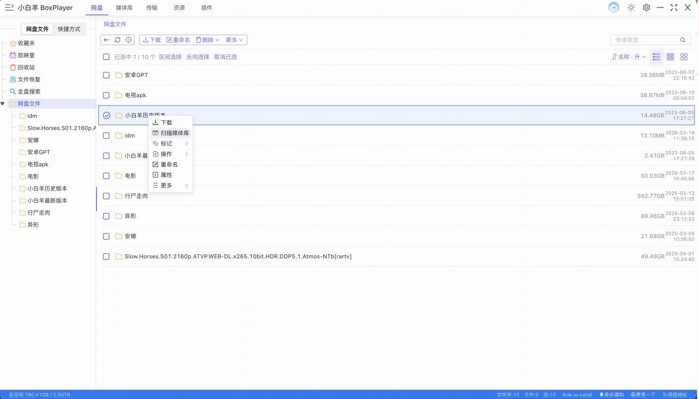
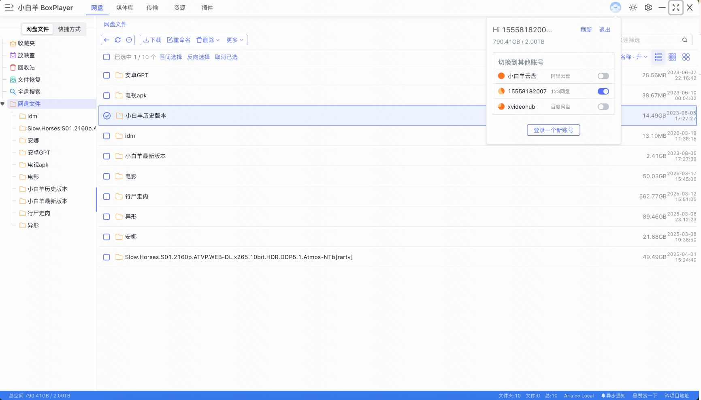
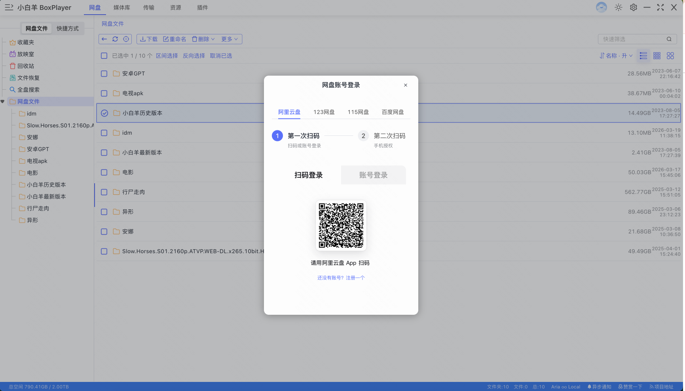

<p align="center">
  
</p>
<p align="center">
    <br> English | <a href="README-CN.md">中文</a>
</p>
<p align="center">
    <em>小白羊网盘 - 多网盘统一管理 + 智能媒体库 + 媒体服务器 + 高速下载.</em>
</p>

<p align="center">
  <a href="LICENSE" target="_blank">
    
  </a>

  <!-- TypeScript Badge -->
  

  <!-- VUE Badge -->
  

  <a href="https://github.com/gaozhangmin/aliyunpan/releases" target="_blank">
    
  </a>

  <a href="https://github.com/gaozhangmin/aliyunpan/releases" target="_blank">
    
  </a>

  <a href="https://github.com/gaozhangmin/aliyunpan/releases" target="_blank">
    
  </a>  

  <a href="https://github.com/gaozhangmin/aliyunpan/stargazers" target="_blank">
    
  </a>

  <a href="https://github.com/gaozhangmin/aliyunpan/releases/latest" target="_blank">
    
  </a>

</p>


[](#功能-) [](#界面-) [](#安装-) [](#小白羊公众号-) [](#交流社区-) [](#鸣谢-) [](#免责声明-)


# 功能 [](#功能-)

## 🖥️ 媒体服务器
1. **多服务器支持**：支持连接 Emby、Jellyfin、Plex 等主流媒体服务器 <br>
2. **自定义服务器图标**：可为每个媒体服务器设置自定义图标，轻松区分多个服务器实例 <br>
3. **首页聚合**：继续观看、最近添加、电影、剧集、动漫等内容一览无余 <br>
4. **全库浏览**：支持按媒体类型（电影、电视剧、动漫、纪录片等）分类浏览，海报墙与列表视图自由切换 <br>
5. **媒体服务器搜索**：支持在媒体服务器内搜索，以及跨服务器聚合搜索 <br>
6. **剧集详情**：显示剧集封面、评分、简介、分集列表，支持继续播放进度记录 <br>

## 🌟 多网盘支持
7. **多平台网盘接入**：支持阿里云盘、百度网盘、123网盘、115网盘等主流网盘服务 <br>
8. **WebDAV 连接**：支持通过 WebDAV 协议连接夸克网盘、天翼云等更多网盘服务 <br>
9. **本地文件夹导入**：支持导入本地文件夹并识别刮削 TMDB 元数据 <br>
10. **多账号管理**：支持同时登录和管理多个网盘账号 <br>

## 🎬 智能媒体库
11. **TMDB 元数据刮削**：自动扫描网盘和本地文件，从 TMDB 获取电影、电视剧等媒体元数据 <br>
12. **媒体库整理**：智能分类整理媒体文件，构建完整的个人媒体库 <br>
13. **聚合搜索**：跨网盘与本地库的统一搜索，快速定位媒体内容 <br>

## 🎥 强大播放功能
14. **在线高清播放**：支持网盘中各种格式的高清原画视频播放 <br>
15. **多音轨切换**：播放器内置多音轨支持，自由选择语言音轨 <br>
16. **外挂字幕**：支持加载外挂字幕文件，多字幕轨道切换 <br>
17. **视频流与清晰度切换**：支持多视频流切换，可根据网络状况选择不同清晰度 <br>
18. **播放速度调整**：支持自定义播放速度 <br>
19. **播放列表管理**：支持创建和管理播放列表 <br>
20. **第三方播放器**：支持 MPV、IINA 等专业播放器 <br>

## ⚡ 高速下载
21. **Aria2c 下载**：集成高速 Aria2c 下载引擎，支持多线程下载 <br>
22. **远程下载**：可通过远程 Aria2 功能将文件直接下载到远程 VPS/NAS <br>

## 📁 文件管理
23. **文件夹树视图**：提供特有的文件夹树，方便快速操作 <br>
24. **智能排序**：显示文件夹体积，支持文件夹和文件的混合排序（文件名/体积/时间）<br>
25. **批量操作**：支持批量重命名大量文件和多层嵌套的文件夹 <br>
26. **快速预览**：可以快速复制文件，预览视频的雪碧图，并直接删除文件 <br>
27. **海量文件处理**：能够管理数万文件夹和数万文件，一次性列出文件夹中的全部文件 <br>
28. **批量传输**：支持一次性上传/下载百万级的文件/文件夹 <br>

## 🖥️ 跨平台支持
29. **全平台兼容**：支持 Windows 7-11、macOS、Linux 等操作系统 <br>

<a href="#readme">
    
</a>

# 界面 [](#界面-)

## 🖥️ 媒体服务器管理
 

*媒体服务器列表 & 服务器卡片视图（支持自定义图标）*

## 🏠 媒体服务器主页
 

*继续观看 & 分类媒体库（图库视图）*

## 🎬 剧集与媒体详情
 

*剧集详情页 & 剧集列表*

## 📺 动漫与分类浏览
 

*动漫库 & 媒体服务器搜索*

## 🔍 媒体库与聚合搜索
 

*聚合搜索 & 本地媒体库列表视图*

## 📂 文件管理界面
 

*文件管理主界面 & 文件夹树视图*

## 👤 多账号登录
 

*多网盘账号管理 & 二维码登录*

<a href="#readme">

</a>

# 安装 [](#安装-)

## 安装包说明（release 文件夹）

`release` 文件夹中包含各平台、各架构的安装包，按文件名中的关键词区分：

### Windows

| 文件名 | 适用平台 | 说明 |
|--------|----------|------|
| `...-win.exe` | Windows（通用） | 自动检测系统架构，**推荐大多数用户使用** |
| `...-win-x64.exe` | Windows 64位 x86 | 适用于 Intel / AMD 64位处理器 |
| `...-win-ia32.exe` | Windows 32位 | 适用于 32位系统或老旧处理器 |
| `...-win-arm64.exe` | Windows ARM64 | 适用于 ARM64 处理器（如高通骁龙 X Elite） |
| `...-win-x64.zip` | Windows 64位 免安装 | 解压即用，无需安装 |
| `...-win-ia32.zip` | Windows 32位 免安装 | 解压即用，无需安装 |
| `...-win-arm64.zip` | Windows ARM64 免安装 | 解压即用，无需安装 |

**安装方式：** 双击 `.exe` 安装包，按提示完成安装。便携版解压 `.zip` 后直接运行 `xbyboxplayer.exe`。

### macOS

| 文件名 | 适用平台 | 说明 |
|--------|----------|------|
| `...-mac-x64.dmg` | macOS Intel | 适用于搭载 Intel 芯片的 Mac |
| `...-mac-arm64.dmg` | macOS Apple Silicon | 适用于搭载 M1 / M2 / M3 / M4 芯片的 Mac |

**安装方式：** 双击 `.dmg` 文件，将应用拖拽至 `Applications` 文件夹即可。Apple Silicon 用户若安装后提示文件损坏，请在终端执行：
```sh
sudo xattr -d com.apple.quarantine /Applications/xbyboxplayer.app
```

### Linux

| 文件名 | 适用平台 | 说明 |
|--------|----------|------|
| `...-linux-amd64.deb` | Debian / Ubuntu x64 | 适用于 Debian、Ubuntu 等发行版，64位 Intel/AMD |
| `...-linux-arm64.deb` | Debian / Ubuntu ARM64 | 适用于 ARM64 架构的 Debian / Ubuntu |
| `...-linux-armv7l.deb` | Debian / Ubuntu ARMv7 | 适用于 32位 ARM 架构的 Debian / Ubuntu |
| `...-linux-x86_64.AppImage` | Linux 通用 x64 | 免安装，适用于绝大多数 64位 Linux 发行版 |
| `...-linux-arm64.AppImage` | Linux 通用 ARM64 | 免安装，适用于 ARM64 架构 Linux 发行版 |
| `...-linux-armv7l.AppImage` | Linux 通用 ARMv7 | 免安装，适用于 32位 ARM Linux 发行版 |
| `...-linux-x64.pacman` | Arch Linux / Manjaro x64 | 适用于 Arch Linux 及衍生发行版，64位 |
| `...-linux-aarch64.pacman` | Arch Linux ARM64 | 适用于 Arch Linux ARM64 |
| `...-linux-armv7l.pacman` | Arch Linux ARMv7 | 适用于 Arch Linux ARMv7 |
| `...-linux-x64.zip` / `arm64.zip` / `armv7l.zip` | Linux 各架构 免安装 | 解压后直接运行可执行文件 |

**安装方式：**
- `.deb`：`sudo dpkg -i <文件名>.deb`
- `.AppImage`：`chmod +x <文件名>.AppImage && ./<文件名>.AppImage`
- `.pacman`：`sudo pacman -U <文件名>.pacman`
- `.zip`：解压后直接运行目录内的可执行文件

---

## Windows
> * ia32：64位x86架构的处理器
> * x64：Apple M1处理器版本
> * portable.exe 免安装版本

1. 在 [Latest Release](https://github.com/gaozhangmin/aliyunpan/releases/latest) 页面下载 `XBYDriver-Setup-*.exe` 的安装包
2. 下载完成后双击安装包进行安装
3. 如果提示不安全，可以点击 `更多信息` -> `仍要运行` 进行安装
4. 开始使用吧！


## MacOS
> * x64：64位x86架构的处理器
> * arm64：Apple M1处理器版本

1.  去 [Latest Release](https://github.com/gaozhangmin/aliyunpan/releases/latest) 页面下载对应芯片以 `.dmg` 的安装包（Apple Silicon机器请使用arm64版本，并注意执行下文`xattr`指令）
2.  下载完成后双击安装包进行安装，然后将 `小白羊` 拖动到 `Applications` 文件夹。
3.  开始使用吧！

## Linux
> * x64：64位x86架构的处理器
> * arm64：64位ARM架构的处理器。
> * armv7l：32位ARM架构的处理器。
### deb安装包
1.  去 [Latest Release](https://github.com/gaozhangmin/aliyunpan/releases/latest) 页面下载以 `.deb` 结尾的安装包
2.  执行`sudo dpkg -i XBYDriver-3.11.6-linux-amd64.deb`
### AppImage安装包
1.  去 [Latest Release](https://github.com/gaozhangmin/aliyunpan/releases/latest) 页面下载以 `.AppImage` 结尾的安装包
2.  chmod +x XBYDriver-3.11.6-linux-amd64.AppImage`
3.  下载完成后双击安装包进行安装。
4.  开始使用吧！


### 故障排除

-   "小白羊网盘" can't be opened because the developer cannot be verified.

    <p align="center">
      
    </p>

  -   点击 `Cancel` 按钮，然后去 `设置` -> `隐私与安全性` 页面，点击 `仍要打开` 按钮，然后在弹出窗口里点击 `打开` 按钮即可，以后就再也不会有任何弹窗告警了 🎉

      <p align="center">
         
      </p>

  -   如果在 `隐私与安全性` 中找不到以上选项，或启动时提示文件损坏（Apple Silicon版本）。打开 `Terminal.app`，并输入以下命令（中途可能需要输入密码），然后重启 `小白羊云盘` 即可：

      ```sh
      sudo xattr -d com.apple.quarantine /Applications/小白羊云盘.app
      ```
<a href="#readme">
    
</a>

# 小白羊公众号 [](#小白羊公众号-)
<p align="center">
  
</p>
<a href="#readme">
    
</a>

# 交流社区 [](#交流社区-)

#### Telegram
[](https://t.me/+wjdFeQ7ZNNE1NmM1)


# 鸣谢 [](#鸣谢-)
本项目基于 https://github.com/liupan1890/aliyunpan 仓库继续开发。

感谢作者 [liupan1890](https://github.com/liupan1890)
<a href="#readme">

</a>

# 免责声明 [](#免责声明-)
1.本程序为免费开源项目，旨在分享网盘文件，方便下载以及学习electron，使用时请遵守相关法律法规，请勿滥用；

2.本程序通过调用官方sdk/接口实现，无破坏官方接口行为；

3.本程序仅做302重定向/流量转发，不拦截、存储、篡改任何用户数据；

4.在使用本程序之前，你应了解并承担相应的风险，包括但不限于账号被ban，下载限速等，与本程序无关；

5.如有侵权，请通过邮件与我联系，会及时处理。
<a href="#readme">

</a>
