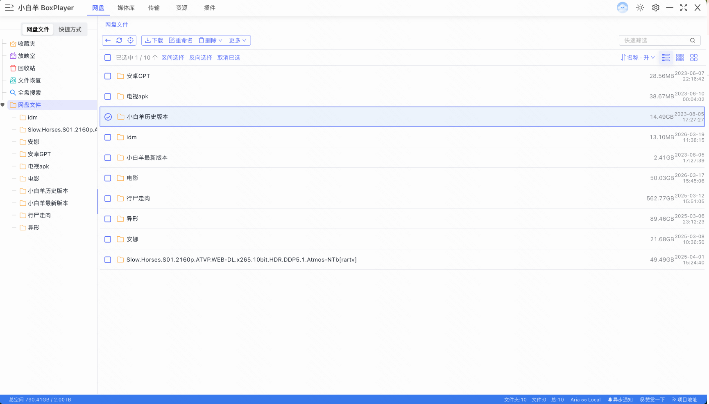
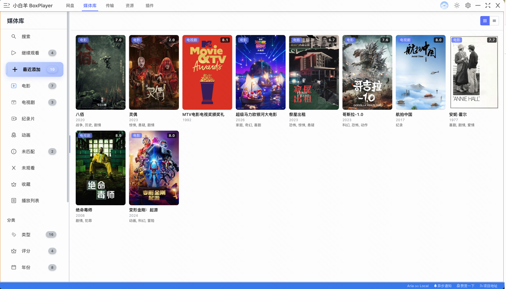
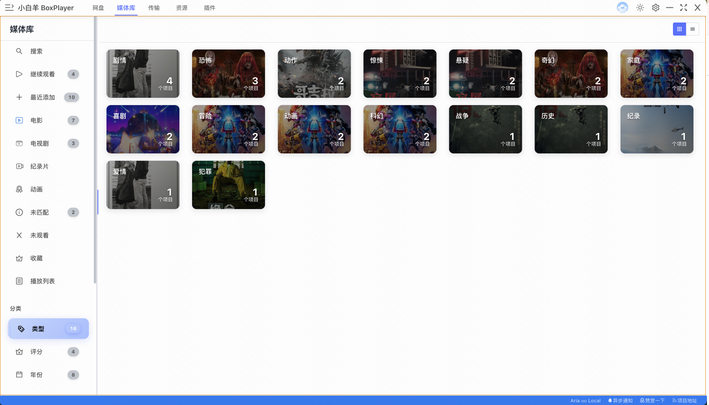
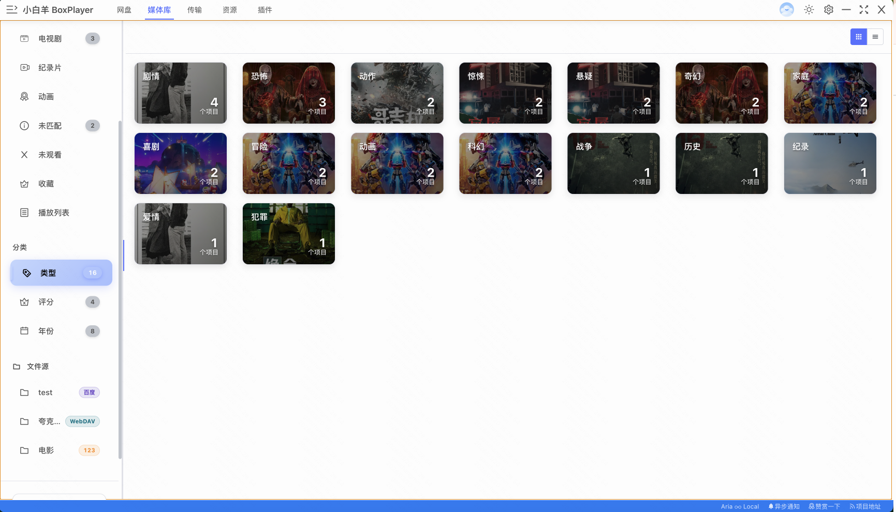
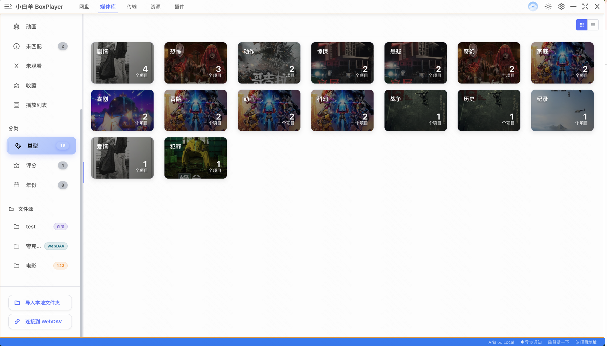

<p align="center">
  
</p>
<p align="center">
    <br> English | <a href="README-CN.md">中文</a>
</p>
<p align="center">
    <em>小白羊网盘 - 多网盘统一管理 + 智能媒体库 + 高速下载.</em>
</p>

<p align="center">
<!--   <a href="https://github.com/gaozhangmin/staticResource/blob/master/images/wechat_public_account.png" target="_blank">
    
  </a> -->
  <a href="LICENSE" target="_blank">
    
  </a>

  <!-- TypeScript Badge -->
  

  <!-- VUE Badge -->
  

  <a href="https://github.com/gaozhangmin/aliyunpan/releases" target="_blank">
    
  </a>

  <a href="https://github.com/gaozhangmin/aliyunpan/releases" target="_blank">
    
  </a>

  <a href="https://github.com/gaozhangmin/aliyunpan/releases" target="_blank">
    
  </a>  

  <a href="https://github.com/gaozhangmin/aliyunpan/stargazers" target="_blank">
    
  </a>

  <a href="https://github.com/gaozhangmin/aliyunpan/releases/latest" target="_blank">
    
  </a>

</p>


[](#功能-) [](#界面-) [](#安装-) [](#小白羊公众号-) [](#交流社区-) [](#鸣谢-) [](#免责声明-)


# 功能 [](#功能-)

## 🌟 多网盘支持
1. **多平台网盘接入**：支持阿里云盘、百度网盘、123网盘、115网盘等主流网盘服务 <br>
2. **WebDAV 连接**：支持通过 WebDAV 协议连接夸克网盘、天翼云等更多网盘服务 <br>
3. **多账号管理**：支持同时登录和管理多个网盘账号 <br>

## 🎬 智能媒体库
4. **TMDB 元数据刮削**：自动扫描网盘和本地文件，从 TMDB 获取电影、电视剧等媒体元数据 <br>
5. **媒体库整理**：智能分类整理媒体文件，构建完整的个人媒体库 <br>
6. **本地文件夹导入**：支持导入本地文件夹并识别刮削 TMDB 元数据 <br>

## 🎥 强大播放功能
7. **在线高清播放**：支持网盘中各种格式的高清原画视频播放 <br>
8. **外挂字幕音轨**：支持外挂字幕、多音轨切换和播放速度调整 <br>
9. **播放列表管理**：支持创建和管理播放列表 <br>
10. **第三方播放器**：支持 MPV、IINA 等专业播放器 <br>

## 🔗 媒体服务器连接
11. **媒体服务器支持**：支持连接 Emby、Jellyfin、Plex 等媒体服务器（部分功能待开发）<br>

## ⚡ 高速下载
12. **Aria2c 下载**：集成高速 Aria2c 下载引擎，支持多线程下载 <br>
13. **远程下载**：可通过远程 Aria2 功能将文件直接下载到远程 VPS/NAS <br>

## 📁 文件管理
14. **文件夹树视图**：提供特有的文件夹树，方便快速操作 <br>
15. **智能排序**：显示文件夹体积，支持文件夹和文件的混合排序（文件名/体积/时间）<br>
16. **批量操作**：支持批量重命名大量文件和多层嵌套的文件夹 <br>
17. **快速预览**：可以快速复制文件，预览视频的雪碧图，并直接删除文件 <br>
18. **海量文件处理**：能够管理数万文件夹和数万文件，一次性列出文件夹中的全部文件 <br>
19. **批量传输**：支持一次性上传/下载百万级的文件/文件夹 <br>

## 🖥️ 跨平台支持
20. **全平台兼容**：支持 Windows 7-11、macOS、Linux 等操作系统 <br>

<a href="#readme">
    
</a>

# 界面 [](#界面-)

## 📂 文件管理界面
 

*文件管理主界面 & 文件夹树视图*

## 👤 多账号登录
 

*多网盘账号管理 & 二维码登录*

## 🎬 智能媒体库
 

*媒体库海报墙 & 网格视图*

## 🎥 媒体详情
 

*媒体列表视图 & 电影详情页面*
<a href="#readme">

</a>

# 安装 [](#安装-)

## Windows
> * ia32：64位x86架构的处理器
> * x64：Apple M1处理器版本
> * portable.exe 免安装版本

1. 在 [Latest Release](https://github.com/gaozhangmin/aliyunpan/releases/latest) 页面下载 `XBYDriver-Setup-*.exe` 的安装包
2. 下载完成后双击安装包进行安装
3. 如果提示不安全，可以点击 `更多信息` -> `仍要运行` 进行安装
4. 开始使用吧！


## MacOS
> * x64：64位x86架构的处理器
> * arm64：Apple M1处理器版本

1.  去 [Latest Release](https://github.com/gaozhangmin/aliyunpan/releases/latest) 页面下载对应芯片以 `.dmg` 的安装包（Apple Silicon机器请使用arm64版本，并注意执行下文`xattr`指令）
2.  下载完成后双击安装包进行安装，然后将 `小白羊` 拖动到 `Applications` 文件夹。
3.  开始使用吧！

## Linux
> * x64：64位x86架构的处理器
> * arm64：64位ARM架构的处理器。
> * armv7l：32位ARM架构的处理器。
### deb安装包
1.  去 [Latest Release](https://github.com/gaozhangmin/aliyunpan/releases/latest) 页面下载以 `.deb` 结尾的安装包
2.  执行`sudo dpkg -i XBYDriver-3.11.6-linux-amd64.deb`
### AppImage安装包
1.  去 [Latest Release](https://github.com/gaozhangmin/aliyunpan/releases/latest) 页面下载以 `.AppImage` 结尾的安装包
2.  chmod +x XBYDriver-3.11.6-linux-amd64.AppImage`
3.  下载完成后双击安装包进行安装。
4.  开始使用吧！


### 故障排除

-   "小白羊网盘" can’t be opened because the developer cannot be verified.

    <p align="center">
      
    </p>

  -   点击 `Cancel` 按钮，然后去 `设置` -> `隐私与安全性` 页面，点击 `仍要打开` 按钮，然后在弹出窗口里点击 `打开` 按钮即可，以后就再也不会有任何弹窗告警了 🎉

      <p align="center">
         
      </p>

  -   如果在 `隐私与安全性` 中找不到以上选项，或启动时提示文件损坏（Apple Silicon版本）。打开 `Terminal.app`，并输入以下命令（中途可能需要输入密码），然后重启 `小白羊云盘` 即可：

      ```sh
      sudo xattr -d com.apple.quarantine /Applications/小白羊云盘.app
      ```
<a href="#readme">
    
</a>

# 小白羊公众号 [](#小白羊公众号-)
<p align="center">
  
</p>
<a href="#readme">
    
</a>

[//]: # (# 请作者喝一杯咖啡 [![]&#40;https://img.shields.io/badge/-%E8%AF%B7%E5%96%9D%E5%92%96%E5%95%A1-blue&#41;]&#40;#请作者喝一杯咖啡-&#41;)

[//]: # (<p align="center">)

[//]: # (  )

[//]: # (  )

[//]: # (</p>)

[//]: # (<a href="#readme">)

[//]: # (    )

[//]: # (</a>)

# 交流社区 [](#交流社区-)

#### Telegram
[](https://t.me/+wjdFeQ7ZNNE1NmM1)


# 鸣谢 [](#鸣谢-)
本项目基于 https://github.com/liupan1890/aliyunpan 仓库继续开发。

感谢作者 [liupan1890](https://github.com/liupan1890)
<a href="#readme">

</a>

# 免责声明 [](#免责声明-)
1.本程序为免费开源项目，旨在分享网盘文件，方便下载以及学习electron，使用时请遵守相关法律法规，请勿滥用；

2.本程序通过调用官方sdk/接口实现，无破坏官方接口行为；

3.本程序仅做302重定向/流量转发，不拦截、存储、篡改任何用户数据；

4.在使用本程序之前，你应了解并承担相应的风险，包括但不限于账号被ban，下载限速等，与本程序无关；

5.如有侵权，请通过邮件与我联系，会及时处理。
<a href="#readme">

</a>
